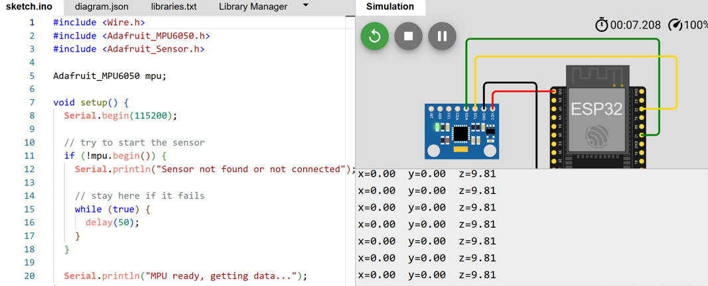
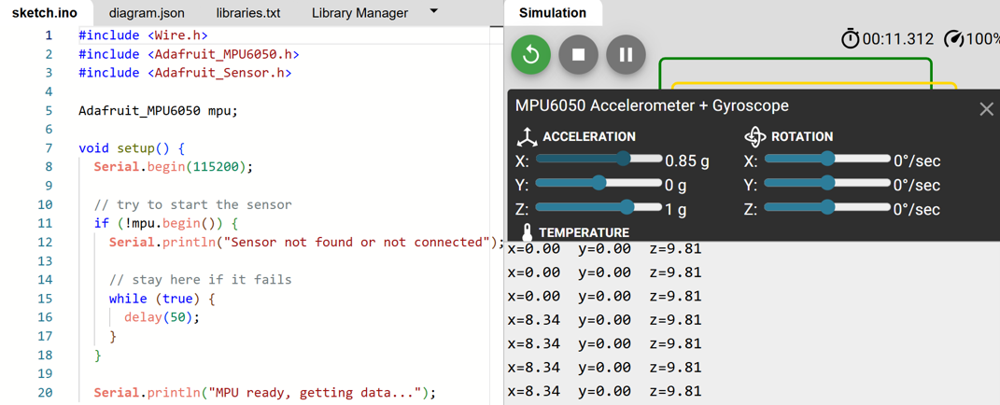
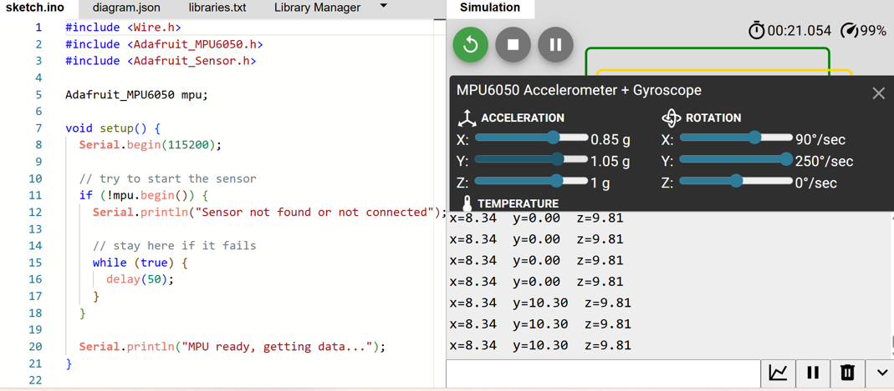

# Learning_Project_3

# MPU6050 Raw Data Reading with ESP32

## Turkish 🇹🇷

Bu projede ESP32 ve MPU6050 sensörü kullanılarak temel ivme verileri okunmuştur.  
Amaç, sensörden gelen X, Y ve Z eksenlerindeki acceleration değerlerini gerçek zamanlı olarak Serial Monitor üzerinden takip etmektir.

Projeyi yaparken MPU6050 sensörünün çalışma mantığını, I2C haberleşmesini ve sensör verilerinin nasıl işlendiğini öğrenmeye çalıştım.  
İlk aşamada sadece ham verileri okuyup sistemin düzgün çalışmasını test ettim.

Bu tarz sensörler günümüzde:

- drone sistemlerinde
- denge kontrol mekanizmalarında
- telefonlarda ekran yönünü algılamada
- robotik projelerde
- otomotiv sistemlerinde
- uçuş kontrol kartlarında

aktif olarak kullanılmaktadır.

Projeyi şu an gerçek donanım imkanlarım sınırlı olduğu için Wokwi simülasyon ortamında test ettim.  
Buna rağmen sensör verilerini doğru şekilde okuyup çalıştırmayı başardım.

İleride gerçek donanımlarla çalışarak:
- daha stabil sistemler,
- gerçek zamanlı grafikler,
- OLED ekranlı arayüzler,
- artificial horizon display,
- flight telemetry tarzı projeler

geliştirmeyi hedefliyorum.

Bu proje benim için MPU6050 ile yaptığım ilk temel denemelerden biri oldu.

---

## Components Used

- ESP32
- MPU6050 Accelerometer + Gyroscope
- Jumper Cables
- Wokwi Simulation

---

## Features

- Real-time acceleration data reading
- X / Y / Z axis monitoring
- Serial Monitor output
- Basic MPU6050 integration
- I2C communication

---

## Images

### Sensor connection and serial monitor



### MPU6050 test panel



### Changing acceleration values



---

## English 🇬🇧

In this project, basic acceleration data was read using an ESP32 and MPU6050 sensor.  
The main goal was to monitor real-time X, Y and Z axis acceleration values through the Serial Monitor.

While developing this project, I tried to better understand:
- MPU6050 sensor logic
- I2C communication
- sensor data processing basics

At this stage, I mainly focused on reading raw sensor data and making the system work correctly.

Today, sensors like MPU6050 are commonly used in:

- drones
- balancing systems
- smartphones
- robotics projects
- automotive systems
- flight controllers

Because my hardware resources are currently limited, I tested the project in the Wokwi simulation environment.  
Even so, I successfully managed to read and process the sensor data correctly.

In the future, I want to improve this project with:
- real hardware testing
- OLED interfaces
- real-time graphs
- artificial horizon systems
- flight telemetry style projects

This project became one of my first practical experiments with the MPU6050 sensor.

---

## Code Example

```cpp
Serial.print("x=");
Serial.print(x);

Serial.print("  y=");
Serial.print(y);

Serial.print("  z=");
Serial.println(z);
```
